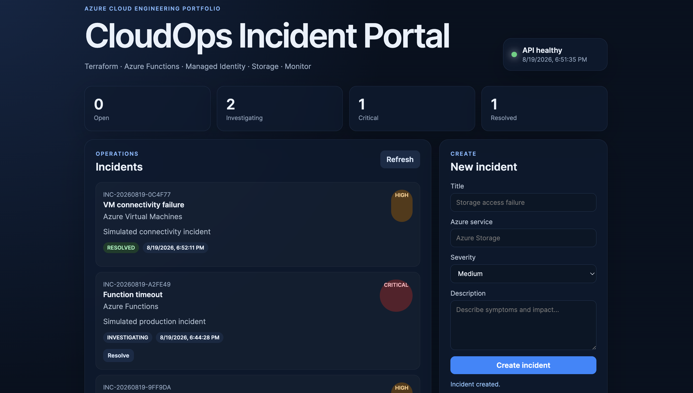
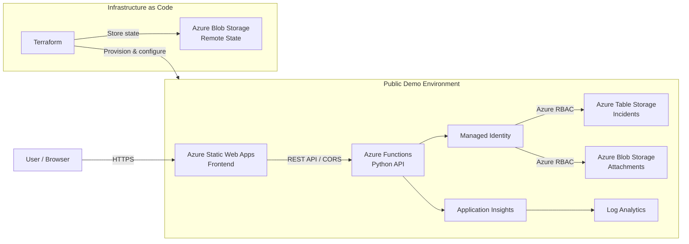

# Azure CloudOps Incident Portal

[](https://github.com/RJ-art914/azure-cloudops-portfolio/actions/workflows/validate.yml)

**Azure cloud engineering portfolio project demonstrating Infrastructure as Code, serverless architecture, managed identity, RBAC, observability, cost awareness and real-world troubleshooting.**

[**Live Demo →**](https://mango-beach-00bd3a40f.7.azurestaticapps.net)



## 30-second overview

This project is more than a CRUD application hosted in Azure. The application is intentionally small so the focus remains on the **cloud infrastructure and operational engineering behind it**.

The environment demonstrates:

- **Terraform Infrastructure as Code**
- **Azure Functions Flex Consumption** with Python
- **Azure Static Web Apps**
- **System-assigned Managed Identity**
- **Azure RBAC** for storage data access
- **Azure Table Storage** for incident data
- **Azure Blob Storage** for future attachment workflows
- **Application Insights + Log Analytics**
- **Remote Terraform state** in a separate Azure Storage Account
- **CORS and HTTPS-based frontend/API communication**
- **Budget and cost alerts**
- **Serverless / cost-conscious architecture**
- **Git and GitHub-based source control**
- **GitHub Actions CI** for Terraform, Python and frontend validation
- Real Azure deployment and troubleshooting experience

---

## Architecture



### Request flow

```text
Browser
   │
   │ HTTPS
   ▼
Azure Static Web Apps
   │
   │ REST API
   ▼
Azure Functions
   │
   │ Managed Identity + RBAC
   ▼
Azure Table Storage

Azure Functions
   │
   └──► Application Insights ──► Log Analytics
```

---

## Why this project exists

The goal of this repository is to demonstrate practical Azure administration and cloud engineering skills rather than application complexity.

The frontend implements a deliberately small incident-management workflow:

```text
Create incident
      ↓
Open
      ↓
Investigating
      ↓
Resolved
```

The main engineering focus is everything required to operate that workflow in Azure:

**provisioning, identity, access control, serverless compute, storage, monitoring, deployment, state management, security configuration and cost control.**

---

## Cloud engineering highlights

### Infrastructure as Code

Azure resources are provisioned with Terraform instead of being manually created in the Azure Portal.

The repository separates:

```text
infrastructure/
├── bootstrap/
│   └── Terraform remote-state infrastructure
│
└── environments/
    └── demo/
        └── Persistent public demo environment
```

Terraform provider lock files are committed for reproducibility, while state files, plan files and local Terraform working directories are excluded from Git.

### Identity and access management

The Function App uses a **system-assigned Managed Identity** for application data access.

Azure RBAC grants the required storage permissions instead of embedding Storage Account keys in the application code.

Application access includes:

- `Storage Table Data Contributor`
- `Storage Blob Data Contributor`

This keeps Azure credentials out of the Python application source.

### Serverless compute

The API runs on **Azure Functions Flex Consumption**.

This allows the public portfolio application to remain available without requiring a continuously running virtual machine.

The frontend is hosted separately using **Azure Static Web Apps**.

### Observability

The deployment includes:

- Application Insights
- Log Analytics
- Function health endpoint
- API health indicator in the frontend

This provides a foundation for application monitoring and future alerting/KQL scenarios.

### Cost awareness

The persistent demo was intentionally designed around lightweight serverless services.

Cost controls include:

- Azure budget configured for the subscription
- Budget alert thresholds
- Serverless compute
- Static Web Apps Free tier
- Small Storage footprint
- Separate future lab environments that can be destroyed after use

More expensive AZ-104 networking and infrastructure exercises will be provisioned separately and removed with Terraform when they are no longer needed.

---

## Troubleshooting experience

Building the environment included several real Azure deployment and configuration problems rather than following a completely clean happy path.

### Azure regional availability

The initial Static Web Apps deployment was rejected because the selected Azure region was not accepting the deployment.

**Resolution:** the Terraform configuration was adjusted to use a supported region and the deployment was repeated without manually recreating the infrastructure.

### Azure Functions deployment

Azure Functions Core Tools initially failed to determine the runtime correctly during deployment.

**Resolution:** the deployment process was corrected to explicitly use Python and Azure remote build:

```bash
func azure functionapp publish <function-app> --python --build remote
```

### Static Web Apps CLI deployment

The original Static Web Apps CLI invocation used an incorrect command structure and deployment directory.

**Resolution:** the deployment script was corrected so the frontend artifact is deployed from the repository root with the generated runtime configuration.

### Browser CORS / preflight failure

Direct API calls succeeded while browser-based `POST` and `PUT` requests failed because of CORS preflight behavior.

**Diagnosis included:**

- direct `curl` API testing
- `OPTIONS` preflight testing
- frontend request-header inspection
- Azure Function CORS configuration

**Resolution:** the Function App CORS policy is now managed through Terraform and allows requests from the deployed Static Web App origin.

These scenarios are documented as part of the project because diagnosing failed deployments and connectivity issues is a core CloudOps skill.

---

## Technology stack

| Area | Technology |
|---|---|
| Cloud | Microsoft Azure |
| Infrastructure as Code | Terraform |
| Frontend | HTML, CSS, Vanilla JavaScript |
| API | Python, Azure Functions |
| Compute | Azure Functions Flex Consumption |
| Frontend hosting | Azure Static Web Apps |
| Data | Azure Table Storage |
| Object storage | Azure Blob Storage |
| Identity | Microsoft Entra ID / Managed Identity |
| Authorization | Azure RBAC |
| Monitoring | Application Insights |
| Logging | Log Analytics |
| Terraform state | Azure Blob Storage |
| Source control | Git + GitHub |
| Cost management | Azure Cost Management / Budget Alerts |

---

## Repository structure

```text
azure-cloudops-portfolio/
│
├── app/
│   ├── api/
│   │   ├── function_app.py
│   │   ├── host.json
│   │   └── requirements.txt
│   │
│   └── frontend/
│       ├── index.html
│       ├── app.js
│       ├── styles.css
│       ├── config.example.js
│       └── staticwebapp.config.json
│
├── infrastructure/
│   ├── bootstrap/
│   │   └── Terraform remote-state bootstrap
│   │
│   └── environments/
│       └── demo/
│           └── Persistent serverless Azure environment
│
├── docs/
│   ├── ARCHITECTURE.md
│   ├── SETUP-DE.md
│   └── images/
│       └── cloudops-dashboard.png
│
├── scripts/
│   ├── deploy.sh
│   ├── deploy.ps1
│   └── preflight-macos.sh
│
└── README.md
```

---

## Security design

Application code does **not** contain Azure Storage Account keys.

The Function App authenticates to application storage using its system-assigned Managed Identity and Azure RBAC.

Repository hygiene also excludes local or generated sensitive artifacts such as:

```text
.env
*.tfstate
*.tfplan
.terraform/
.venv/
local.settings.json
app/frontend/config.js
```

The Function deployment-storage configuration currently still uses the storage mechanism required by the existing Flex Consumption Terraform configuration. Further identity-based hardening is planned separately.

The public demo is a portfolio environment rather than a production workload.

---

## Deployment

### Prerequisites

Typical tooling includes:

- Azure CLI
- Terraform
- Azure Functions Core Tools
- Python 3.12
- Node.js / npm

For detailed setup instructions, see:

[`docs/SETUP-DE.md`](docs/SETUP-DE.md)

### macOS / Linux

```bash
chmod +x scripts/deploy.sh
./scripts/deploy.sh
```

### Windows PowerShell

```powershell
./scripts/deploy.ps1
```

---

## Current project status

### Completed

- [x] Terraform repository foundation
- [x] Remote Terraform state bootstrap
- [x] Azure Static Web Apps frontend
- [x] Python Azure Functions API
- [x] Azure Table Storage
- [x] Azure Blob Storage foundation
- [x] Managed Identity
- [x] Azure RBAC
- [x] Application Insights
- [x] Log Analytics
- [x] Incident create/read/update workflow
- [x] API health monitoring
- [x] Terraform-managed CORS configuration
- [x] Azure budget and cost alerts
- [x] Public GitHub repository
- [x] Public live demo

### Planned

- [x] GitHub Actions validation CI
- [ ] AZ-104 networking lab
- [ ] VNet / subnet / NSG scenarios
- [ ] Private Endpoint + Private DNS
- [ ] Azure Policy and governance exercises
- [ ] Network troubleshooting scenarios
- [ ] Additional monitoring and KQL exercises
- [ ] GitHub Actions + Azure OIDC deployment
- [ ] Additional security hardening

---

## Planned AZ-104 lab

The next infrastructure phase will be isolated from the persistent public demo.

It will be provisioned only when needed:

```text
terraform apply
      ↓
AZ-104 lab exercises
      ↓
Troubleshooting
      ↓
terraform destroy
```

Planned topics include:

- Virtual Networks
- Subnets
- Network Security Groups
- VNet Peering
- Route Tables
- Private Endpoints
- Private DNS
- Azure Policy
- Resource Locks
- RBAC
- Azure Monitor
- Network troubleshooting

This keeps the public demo inexpensive while allowing the repository to expand into more traditional Azure administration scenarios.

---

## Scope

This is a **cloud engineering portfolio lab**, not a production SaaS platform.

The application layer is intentionally lightweight. Its purpose is to provide a real workload around which Azure infrastructure, operations, monitoring, security and troubleshooting concepts can be demonstrated.